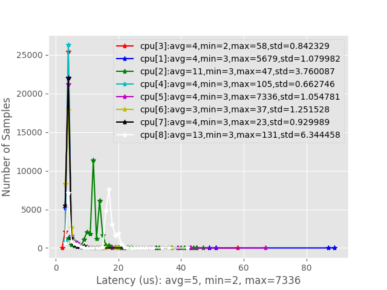

[![Contributors][contributors-shield]][contributors-url]
[![Forks][forks-shield]][forks-url]
[![Stargazers][stars-shield]][stars-url]
[![Issues][issues-shield]][issues-url]
[![MIT License][license-shield]][license-url]
[![LinkedIn][linkedin-shield]][linkedin-url]

<br />
<p align="center">
    <!--- relative path means image/image.png instead of https://etc... -->
                               
</a>

  <h3 align="center">A Toolbox to treat latency data (Linux based)</h3>

  <p align="center">
    Use the latency test of Xenomai or cyclictest to scan your system and plot the data as an histogram.
    <br />
    <a href="https://github.com/mastererts/xenomai-latency-plotter/readme.md"><strong>Explore the docs »</strong></a>
    <br />
    <br />
    <a href="https://github.com/mastererts/xenomai-latency-plotter">View Demo</a>
    ·
    <a href="https://github.com/mastererts/xenomai-latency-plotter/issues">Report Bug</a>
    ·
    <a href="https://github.com/mastererts/xenomai-latency-plotter/issues">Request Feature</a>
  </p>
</p>

## Table of Contents

* [Setup](#setup)
* [Run](#run)
* [Roadmap](#roadmap)
* [Contribute](#contribute)
* [License](#license)
* [Contact](#contact)
* [Contributors](#contributors)

## Setup

1. (Optional) Click on `Fork`
2. Clone the project on your local machine : `git clone https://github.com/mastererts/xenomai-latency-plotter.git`
3. Install dependencies : `python -m pip install -r requirements.txt`
4. Install cyclictest : 
```sh
$ sudo apt install build-essential libnuma-dev
$ git clone git://git.kernel.org/pub/scm/linux/kernel/git/clrkwllms/rt-tests.git
$ cd rt-tests
$ make all
$ cp ./cyclictest /usr/bin
$ rm -rf rt-tests
```
5. Install stress : `sudo apt install stress`

## Run

1. Cyclictest
```sh
# Assuming you're in the repo
$ cd scripts
$ sudo ./cyclic_test.sh
```

2. Xenomai Latency Test
```sh
# Assuming you're in the repo
$ cd scripts
$ sudo ./xeno_latency_test.sh
```

3. (Optional) Stress in another terminal
```sh
# Assuming you're in the repo
$ cd scripts
$ sudo ./stress_test.sh
```

## Roadmap

See the [open issues](https://github.com/mastererts/xenomai-latency-plotter/issues) for a list of proposed features (and known issues).

## Contribute

Contributions are what make the open source community such an amazing place to learn, inspire, and create. Any contributions you make are **greatly appreciated**.

### Contribute on proposed features

1. Choose any open issue from [here](https://github.com/mastererts/xenomai-latency-plotter/issues). 
2. Comment on the issue: `Can I work on this?` and get assigned.
3. Make changes to your `Fork` and send a PR.

Otherwise just create the issue yourself, and we'll discuss and assign you to it if serves the project !

To create a PR:

Follow the given link to make a successful and valid PR: https://help.github.com/articles/creating-a-pull-request/

To send a PR, follow these rules carefully, **otherwise your PR will be closed**:

1. Make PR title in this formats: 
```
Fixes #IssueNo : Name of Issue
``` 
```
Feature #IssueNo : Name of Issue
```
```
Enhancement #IssueNo : Name of Issue
```

According to what type of issue you believe it is.

For any doubts related to the issues, i.e., to understand the issue better etc, comment down your queries on the respective issue.

## License

Distributed under the MIT License. See `LICENSE` for more information.

## Contact

Erwin Lejeune - [@spida_rwin](https://twitter.com/spida_rwin) - erwin.lejeune15@gmail.com

## Contributors

- [Erwin Lejeune](https://github.com/Guilyx)
- [Lu Ken](https://github.com/kenplusplus)

[contributors-shield]: https://img.shields.io/github/contributors/mastererts/xenomai-latency-plotter.svg?style=flat-square
[contributors-url]: https://github.com/mastererts/xenomai-latency-plotter/graphs/contributors
[forks-shield]: https://img.shields.io/github/forks/mastererts/xenomai-latency-plotter.svg?style=flat-square
[forks-url]: https://github.com/mastererts/xenomai-latency-plotter/network/members
[stars-shield]: https://img.shields.io/github/stars/mastererts/xenomai-latency-plotter.svg?style=flat-square
[stars-url]: https://github.com/mastererts/xenomai-latency-plotter/stargazers
[issues-shield]: https://img.shields.io/github/issues/mastererts/xenomai-latency-plotter.svg?style=flat-square
[issues-url]: https://github.com/mastererts/xenomai-latency-plotter/issues
[license-shield]: https://img.shields.io/github/license/mastererts/xenomai-latency-plotter.svg?style=flat-square
[license-url]: https://github.com/mastererts/xenomai-latency-plotter/blob/master/LICENSE.md
[linkedin-shield]: https://img.shields.io/badge/-LinkedIn-black.svg?style=flat-square&logo=linkedin&colorB=555
[linkedin-url]: https://linkedin.com/in/erwinlejeune-lkn
